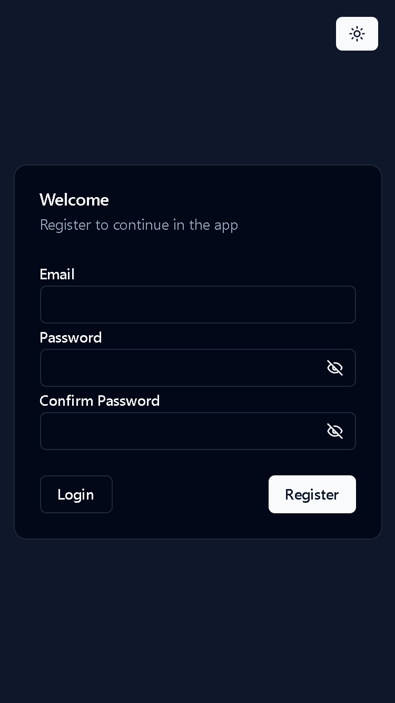
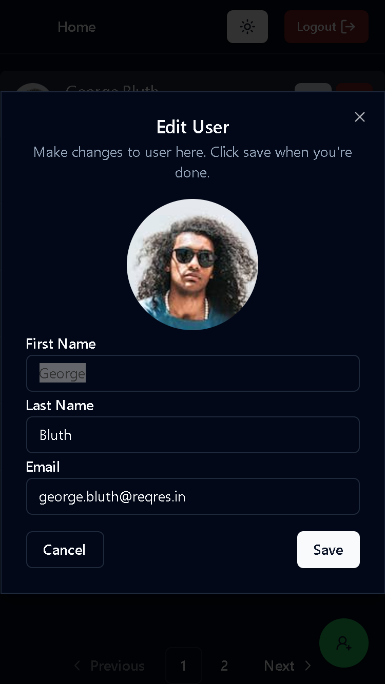
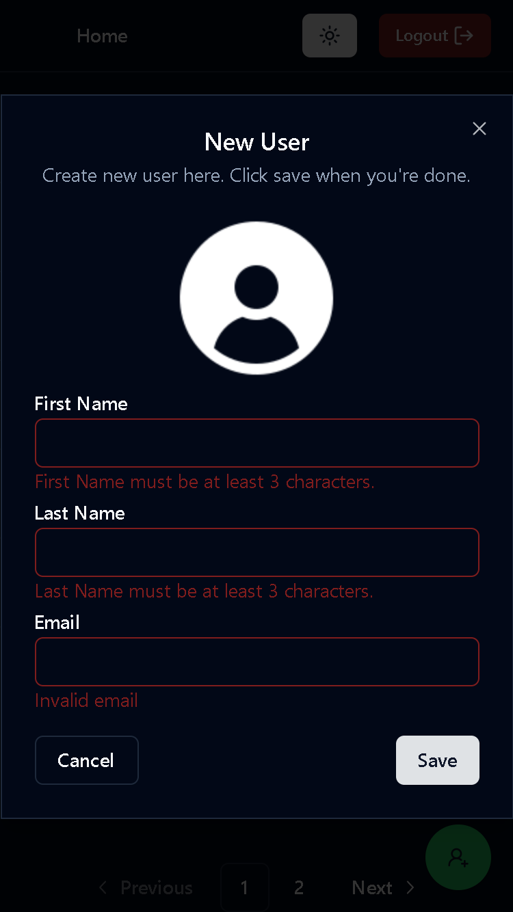

<h1 align="center">1GLOBAL</h1>
<div align="center">


</div>

This project is a simple application made in React using the [Reqres.in API](https://reqres.in/), its goal is to apply the best practices for the development of an application in React.

This application implements a simple authentication and listing system with CRUD, available only to authenticated users

This application is also available on [github pages](http://carloshrabelo.dev/1global/)

## Preview
| Page                   | Ligth                           | Dark                           |
| ------------------------- | -------------------------------- | -------------------------------- |
| Signin |  |  |
| Signup |  |  |
| Home |  |  |
| Edit User |  |  | 
| New User |  |  | 

## Strange behaviors

Because it is a test application and is connected to an example server, the application behaves differently than a real application when we create and delete users.

As BE does not implement these functions, I simulated these functions ignoring paging, in a real application, we would invalidate the cache so that BE would return the updated data.

In a real application, new users should go to the end of the page and when removing the user, the next page should be displayed. For reasons of practicality, these changes are only applied to the current page.

## Installation

You need the [node](https://nodejs.org/en/download/) to run this project, this example was created for the version `v20.10.0`. Dependencies was installed with [yarn](https://classic.yarnpkg.com/en/)

### Install yarn
```bash
npm -g yarn
```

### Install dependencies
```bash
yarn install
```

## Run application

Before running the application you will need to create a `.env` file in the project root, you can rename `.env.sample` without needing to make any changes

### Dev

```bash
yarn start
```

### Prod

```bash
yarn build

npm install -g serve
serve -s build
```

Open [http://localhost:3000](http://localhost:3000) with your browser to see the result.

## Folder structure

```
📂 cypress - Cypress configuration and e2e tests
📂 docs - Files referring to documentation
📂 public - Static file serving
📂 src/
┣━╾📂 app - Pages that reflect the browser address
┣━╾📂 components - UI components
  ┗━╾📂 ui - UI components provided by shadcn/ui
┣━╾📂 lib - Libraries configuration
┣━╾📂 mock - Mocks files to be used in test files
┣━╾📂 store - Redux store
┣━╾📂 types - Types
┗━╾📂 utils - Functions helpers
```

## Licença

The [MIT License]() (MIT)

Copyright :copyright: 2024
